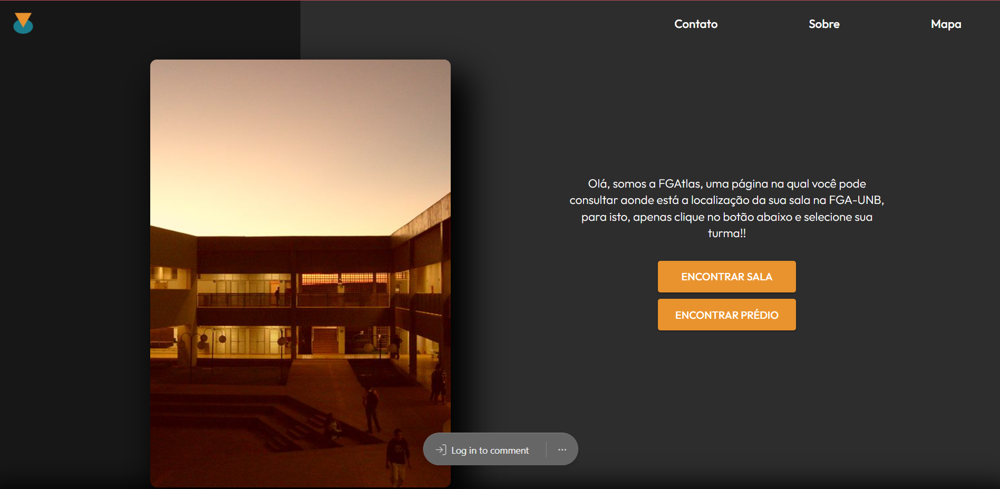
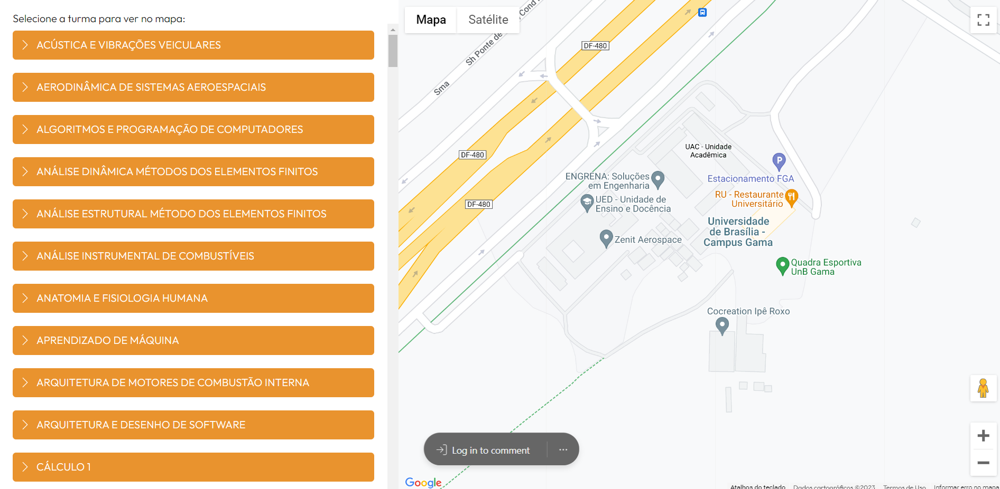
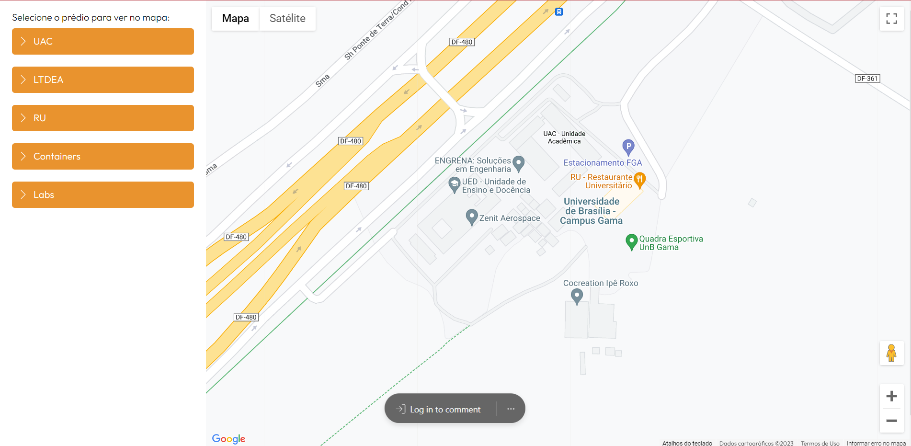

# 2022-2-Squad04 - FGAtlas

<a name="readme-top"></a>

[![Contributors][contributors-shield]][contributors-url]
[![Forks][forks-shield]][forks-url]
[![Issues][issues-shield]][issues-url]
[![maintainability][maintainability-shield]][maintainability-url]
[![MIT License][license-shield]][license-url]

<!-- PROJECT LOGO -->
<br />
<div align="center">
  <a href="https://github.com">
    
  </a>

  <h3 align="center">FGAtlas</h3>

  <p align="center">
    Um incrível mapa para se localizar na FGA!
    <br />
    <a href="https://github.com/fga-eps-mds/2022-2-FGAtlas/issues">Reportar Bug</a>
    ·
    <a href="https://github.com/fga-eps-mds/2022-2-FGAtlas/issues">Recomendar Feature</a>
  </p>
</div>

<!-- TABLE OF CONTENTS -->
<details>
  <summary>Conteúdo</summary>
  <ol>
    <li>
      <a href="#Sobre-o-projeto">Sobre o projeto</a>
      <ul>
        <li><a href="#Tecnologias">Tecnologias</a></li>
      </ul>
    </li>
    <li><a href="#Pré-requisitos">Pre-Requisitos</a></li>
    <li><a href="#Como-rodar">Como rodar</a></li>
    <li><a href="#Backlog-do-produto">Backlog do produto</a></li>
    <li><a href="#Devenvolvedores">Desenvolvedores</a></li>
    <li><a href="#Como-contribuir">Como contribuir</a></li>
    <li><a href="#licença">Licença</a></li>
  </ol>
</details>


<!-- ABOUT THE PROJECT -->
## :earth_americas: Sobre o projeto

FGAtlas é um projeto web que fornece a localização dos prédios e salas da FGA, a fim de auxiliar calouros e veteranos a encontrarem os locais onde terão suas aulas. A ideia surgiu após a equipe realizar, em grupos da faculdade, uma pesquisa via forms na qual questionava os estudantes qual era a maior dificuldade dos mesmos no campus, a grande parte das respostas foram direcionadas à questões envolvendo localização. Segue algumas telas da aplicação:

<!-- PROJECT PRINTS -->
<br />
<div align="center">
  <a href="https://github.com">
    
  </a>
  <a href="https://github.com">
    
  </a>
  <a href="https://github.com">
    
  </a>
  <a href="https://github.com">
    
  </a>
 </div>

## :hammer: Tecnologias

Tecnologias utilizadas neste repositório: 


<!-- GETTING STARTED -->
## :exclamation: Pré-requisitos

Antes de começar, você precisa ter instalado as seguintes ferramentas: 
- [Postgres14](https://www.postgresql.org/download/);
- [NodeJs 16.17.0](https://nodejs.org/en/blog/release/v16.16.0/);
- [git](https://git-scm.com/download/win).

## :chart_with_upwards_trend: Como rodar

Para executar o backend:
1.	Clone o repositório
```
git clone https://github.com/fga-eps-mds/2022-2-FGAtlas.git
```

2. 	Instale todas as dependências do repositório com:
```
npm install
```

3.	Inicie a aplicação com o comando:

```
npm run start
```

Para executar o frontend:
1. Clone o repositório
```
git clone https://github.com/fga-eps-mds/2022-2-FGAtlas.git
```

2. Vá para a pasta do vite
```
cd ./vite-project
```

3. Instale todas as dependências com:
```
npm install
```

4. Execute no terminal:

```
npm run dev
```

Para executar os testes do backend:
1. 	Clone o repositório
```
git clone https://github.com/fga-eps-mds/2022-2-FGAtlas.git
```
2. 	Crie um novo banco de dados para testes com:
```
dbcreate fgatlasdb_test
```

3. 	Instale todas as dependências do repositório com:
```
npm install
```
4. 	Inicie os testes com:
```
npm run test
```

Para executar os testes do frontend:
1. 	Clone o repositório
```
git clone https://github.com/fga-eps-mds/2022-2-FGAtlas.git
```

2. Vá para a pasta do vite
```
cd ./vite-project
```

3. Instale todas as dependências com:
```
npm install
```

4. Execute no terminal:

```
npx cypress open
```

## :orange_book: Backlog do produto

Para visualizar o BackLog do produto, acesse: [BackLog](https://github.com/fga-eps-mds/2022-2-FGAtlas/blob/main/Docs/BackLog%20-%20FGAtlas.png)

<!--WHERE WE CONTRIBUT-->
## :heart: Comunidade

Para conseguir desenvolver o projeto FGAtlas de maneira produtiva e dinâmica utilizamos o [Whatsapp](https://chat.whatsapp.com/CPuI4yEmlGc8696iUD4hgA) para uma comunicação mais rápida e para realizar as reuniões, como 
dailys e reuniões semanais, e definição de Sprints e Issues utilizamos o [Discord](https://discord.gg/Txkht4J7). Além disso, para organização do código e comentar detalhes importantes utilizamos as próprias Issues. Para uma melhor organização das issues e para uma metrificação mais detalhada das contribuições utilizamos o [ZenHub](https://app.zenhub.com/workspaces/fgatlhas-638138d3a6b09c276ce2f78c/board?invite=LZvdxJcbarJnV5o7BLmqCN8D). 

<!-- CONTRIBUTING -->
## :question: Como contribuir 

Para contribuir com o projeto leia o [Guia de Contribuição](https://github.com/fga-eps-mds/2022-2-FGAtlas/blob/main/CONTRIBUTING.md) e para saber como
se deve comportar para um bom andamento do projeto, leia nosso [Código de Conduta](https://github.com/fga-eps-mds/2022-2-FGAtlas/blob/main/CODE_OF_CONDUCT.md)

## :smile: Desenvolvedores

<center>
<table style="margin-left: auto; margin-right: auto;">
    <tr>
        <td align="center">
            <a href="https://github.com/ccarlaa">
                
                <h5 class="text-center">Carla Clementino</h5>
            </a>
        </td>
        <td align="center">
            <a href="https://github.com/deboracaires">
                
                <h5 class="text-center">Debora Caires</h5>
            </a>
        </td>
        <td align="center">
            <a href="https://github.com/bot-do-jao">
                
                <h5 class="text-center">João Pedro</h5>
            </a>
        </td>
        <td align="center">
            <a href="https://github.com/kaua-pt">
                
                <h5 class="text-center">Kauã Vinícius ✠ </h5>
            </a>
        </td>
        <td align="center">
            <a href="https://github.com/Lizdtre">
                
                <h5 class="text-center">Paulo Renato</h5>
            </a>
        </td>
         <td align="center">
            <a href="https://github.com/StrangeUnit28">
                
                <h5 class="text-center">Rafael Brito</h5>
            </a>
        </td>
	<td align="center">
            <a href="https://github.com/sabrinaberno">
                
                <h5 class="text-center">Sabrina Berno</h5>
            </a>
        </td>
</table>

</center>

### Autoavaliação do grupo
Foi feita uma [autoavalição dos membros na Release 1](https://github.com/fga-eps-mds/2022-2-FGAtlas/blob/main/Docs/Autoavalia%C3%A7%C3%A3o_dos_membros.md) em relação a contribuição com o projeto, assim como na [Release 2](https://github.com/fga-eps-mds/2022-2-FGAtlas/blob/main/Docs/Autoavalia%C3%A7%C3%A3o%20dos%20membrosR2.md). É possível observar nos documentos que o grupo teve um desempenho bem equilibrado, o que contribuiu para um bom trabalho em equipe.

## :skull: Post Mortem

O grupo fez um [Post Mortem](https://github.com/fga-eps-mds/2022-2-FGAtlas/blob/main/Docs/Post%20Mortem%20MDS.pdf) para descrever um pouco da experiência de cada membro dentro da matéria e durante o desenvolvimento da aplicação. O documento também é voltado para auxiliar futuros alunos da matéria de MDS.

## &#128511; Autores

Kauã Vinícius e Rafael Bosi

<!-- LICENSE -->
## :dash: Licença

Distributed under the MIT License. See [LICENSE](https://github.com/fga-eps-mds/2022-2-FGAtlas/blob/main/LICENSE) for more information.


<!-- MARKDOWN LINKS & IMAGES -->
[contributors-shield]: https://img.shields.io/github/contributors/fga-eps-mds/2022-2-FGAtlas.svg?style=for-the-badge
[contributors-url]:https://github.com/fga-eps-mds/2022-2-FGAtlas/graphs/contributors
[forks-shield]: https://img.shields.io/github/forks/fga-eps-mds/2022-2-FGAtlas.svg?style=for-the-badge
[forks-url]: https://github.com/fga-eps-mds/2022-2-FGAtlas/network/members
[stars-shield]: https://img.shields.io/github/stars/fga-eps-mds/2022-2-FGAtlas.svg?style=for-the-badge
[stars-url]: https://github.com/othneildrew/Best-README-Template/stargazers
[issues-shield]: https://img.shields.io/github/issues/fga-eps-mds/2022-2-FGAtlas.svg?style=for-the-badge
[issues-url]: https://github.com/fga-eps-mds/2022-2-FGAtlas/issues
[maintainability-shield]: https://img.shields.io/codeclimate/maintainability-percentage/fga-eps-mds/2022-2-FGAtlas?style=for-the-badge
[maintainability-url]: https://codeclimate.com/github/fga-eps-mds/2022-2-FGAtlas/maintainability
[license-shield]: https://img.shields.io/github/license/fga-eps-mds/2022-2-FGAtlas.svg?style=for-the-badge
[license-url]: https://github.com/fga-eps-mds/2022-2-FGAtlas/blob/main/LICENSE
[product-screenshot]: images/screenshot.png

